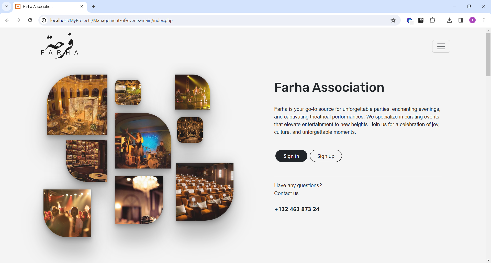
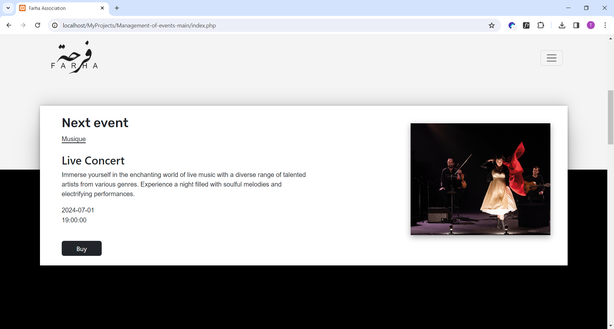
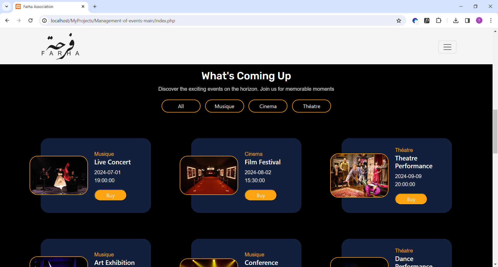
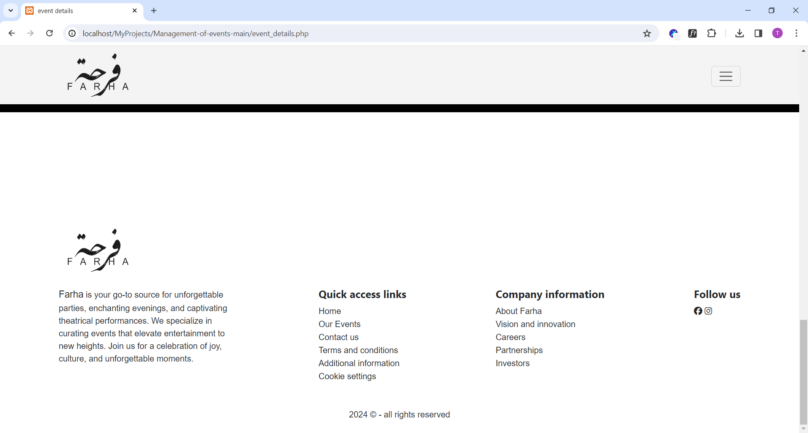
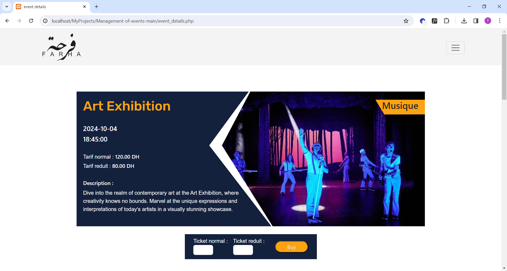
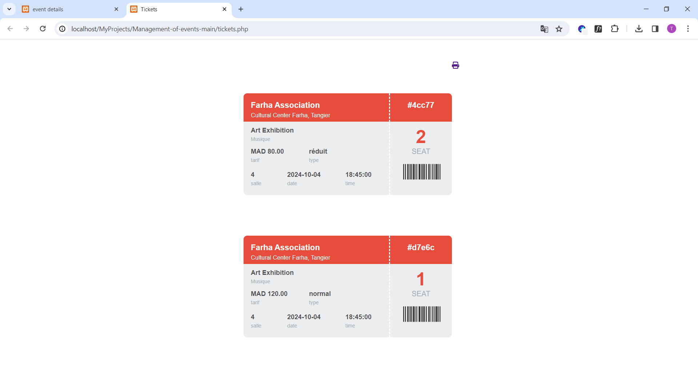
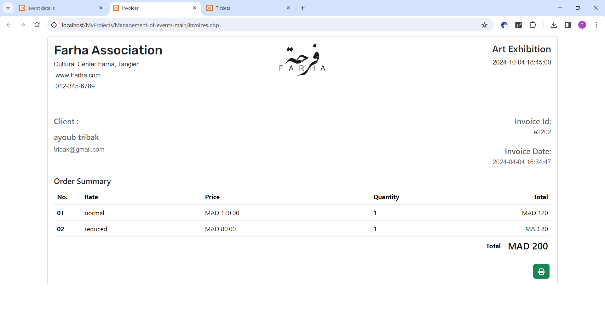
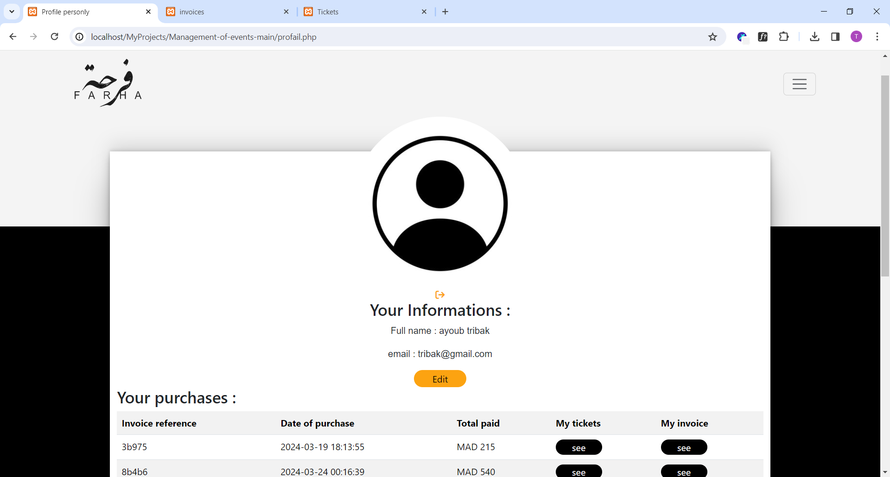

# Management-of-events
Management of Cultural Association Events
# Context
Developed a PHP web application to manage event bookings for Farha Association. This app will provide users the ability to browse upcoming events, purchase tickets, and manage their reservations.

# Interfaces
## Homepage
* Display a catalog of upcoming events sorted by date (in the form of cards), showing for each event: the title, image, date, category, and a button "Buy" OR a "Sold Out" button in case tickets are no longer available.
* Add a search bar by title.
* Add the following 2 filters:
 * List events between two given dates.
 * List events by category (music, cinema, theater...).

## Event Details Page
* When the user clicks on the "Buy" or "Sold Out" button, they will be redirected to a page displaying the event details: title, image (in large size), description, date.
* A form allowing the user to specify the number of tickets to purchase (for both types of rates).
* A user is only allowed to submit this purchase form when logged in.
* If the user is already logged in, clicking the "Submit" button of the form displays a confirmation message with an option to view the tickets and the invoice.
* Purchase validation is successful if the number of tickets to buy is still available.
* The seat number to assign to each ticket depends on the capacity of the room where the event takes place.
* Seat numbers are assigned sequentially.
  
  
  
## Authentication and Registration Page
* A new user must register to make a purchase.
* A user with an existing account must log in before making a purchase.
## User Profile
When the user is logged in, they can:

* View and modify their personal information (name, surname, email...)
* View the list of their purchases in the form of a table displaying: the invoice reference, the purchase date, and the total paid, with the possibility to view the tickets and the invoice using two buttons "View My Tickets" and "View My Invoice".
